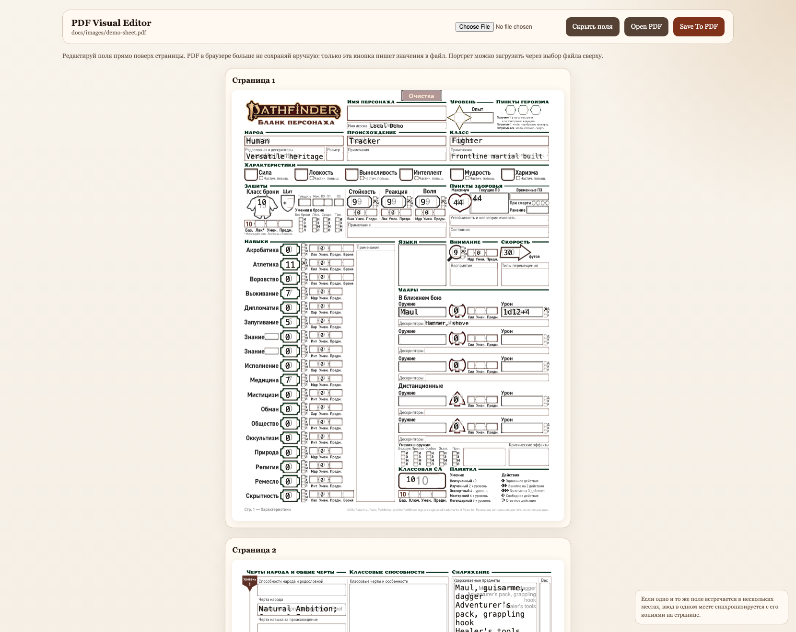
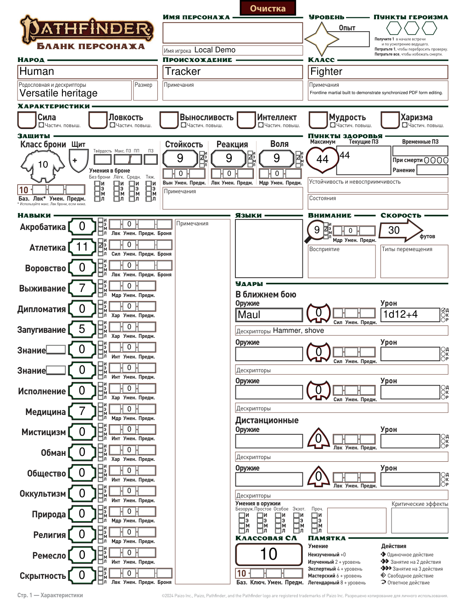

# pf2e-pdf-tools

Toolkit for editing fillable TTRPG character sheet PDFs without breaking form rendering.

The project exists because these PDFs keep state in two places at once:
- page widgets,
- `AcroForm /Fields`.

If you update only one layer, different viewers start disagreeing. Text may look fine in one app and disappear in another, or saving in Preview may flatten or destroy the form state.

This repo keeps those layers in sync and provides a safer editing workflow.

## At a glance

- safe editing for Pathfinder 2e and D&D 5e fillable sheets
- one core engine for field updates, autosize, image insertion, and form synchronization
- local web UI for page-based editing on top of rendered PDF pages
- `uv`-managed environment with a checked-in lockfile
- canonical public templates in `templates/`
- private local files isolated in `templates/local/`

## Screenshots

### Visual editor



### Rendered output



## Highlights

- Keeps page widgets and `AcroForm /Fields` synchronized.
- Autosizes text without rewriting field values or checkboxes.
- Provides a local visual editor for direct page-based form editing.
- Detects image/button fields and supports uploading portraits or other artwork through the web editor.
- Works with the canonical Pathfinder 2e base and with tracked D&D templates in `templates/`.

## Template-specific notes

- `templates/RM_CharacterSheet_Fillable.pdf`
  Pathfinder 2e canonical base for rebuilds, repair work, and field-level editing.

- `templates/DnD_5E_CharacterSheet_Form_Fillable_ru.pdf`
  D&D 5e 2014 Russian sheet.
  Supports text, checkboxes, and image/button fields.
  Verified image slots include `CHARACTER IMAGE` and `Faction Symbol Image`.
  This localized template has mismatched internal skill field names versus the printed Russian skill labels.
  `PdfFormEditor` now detects this template profile and remaps skill values and skill proficiency checkboxes to the visible rows automatically when you use logical D&D skill names.

- `templates/DnD_2024_Character-Sheet-Fillable-RUS.pdf`
  D&D 2024 Russian sheet.
  Supports text and checkboxes through the same tooling.
  The printed rows line up correctly, but the underlying PDF uses anonymous field ids like
  `text_69...` and `checkbox_128...` instead of meaningful names.
  `PdfFormEditor` now detects this template too and remaps logical D&D skill names and skill
  proficiency checkboxes to the right raw fields automatically.
  No image/button portrait slots are currently exposed by this template, so the web editor has no image-upload target there.

- Static printed text that is baked into a PDF background is not editable through the form tools.
  The editor only changes actual fillable PDF fields and detected image/button widgets.

## Repository layout

- `scripts/pdf_form_editor.py`
  Generic editor for fillable PDF forms.
  Updates visible widget state and structural form values together.

- `scripts/pdf_form_tool.py`
  Autosize-only CLI.
  Changes font sizing and appearance only.
  Does not rewrite field values or checkboxes.

- `scripts/pdf_form_web_editor.py`
  Local visual web editor for PDF forms.
  Renders page images with editable text fields and checkboxes overlaid on top.
  Supports image upload for detected PDF button/image fields.

- `templates/`
  Public PDF templates and reference sheets tracked in the repository.

- `templates/RM_CharacterSheet_Fillable.pdf`
  Canonical Pathfinder 2e fillable base used for rebuilds and repair work.

- `templates/DnD_5E_CharacterSheet_Form_Fillable_ru.pdf`
  Russian D&D 5e fillable sheet supported by the same editor and autosize pipeline.

- `templates/local/`
  Private local template directory.
  Files placed there are ignored by git and stay off GitHub.

## Why this exists

Standard viewers are unreliable for this sheet:
- macOS Preview can destroy or flatten form data on save.
- IDE PDF viewers often display forms but do not persist edits correctly.
- browser viewers may render fields differently from Acrobat-compatible tools.

This project gives you a controlled path:
1. edit with the provided tools,
2. autosize once,
3. verify in Chrome or an Acrobat-compatible viewer.

## Quick start

Requirements:
- Python `3.10+`
- `uv`
- Chromium via Playwright only if you want automated browser screenshots

First-time setup after cloning:

```bash
git clone <repo-url>
cd pf2e_pdf_tools
uv sync
```

Create or sync the project environment:

```bash
uv sync
```

You do not need to activate `.venv` manually for normal use. Prefer `uv run ...`.

Optional, only if you want automated browser screenshots:

```bash
uv sync --extra screenshots
uv run playwright install chromium
```

Run the visual editor:

```bash
uv run python scripts/pdf_form_web_editor.py /path/to/file.pdf --open-browser
```

Autosize after editing:

```bash
uv run python scripts/pdf_form_tool.py /path/to/file.pdf
```

Watch one file:

```bash
uv run python scripts/pdf_form_tool.py /path/to/file.pdf --watch
```

Watch a directory:

```bash
uv run python scripts/pdf_form_tool.py --watch-dir /path/to/folder
```

Open a tracked template in the web editor:

```bash
uv run python scripts/pdf_form_web_editor.py \
  templates/DnD_5E_CharacterSheet_Form_Fillable_ru.pdf \
  --open-browser
```

## Minimal API example

```python
from pathlib import Path
from scripts.pdf_form_editor import PdfFormEditor

pdf = Path("/path/to/file.pdf")
editor = PdfFormEditor(pdf)

editor.set_text("ancestry_name", "Человек")
editor.set_checkbox("skill_athletics_prof_e", True)
editor.autosize_text_fields("filled")
editor.save()
editor.close()
```

For the localized D&D sheets, prefer the logical skill helpers instead of raw widget names:

```python
editor.set_skill_values({
    "Perception": "+4",
    "Intimidation": "+2",
    "Insight": "+4",
})
editor.set_skill_proficiencies({
    "Perception": True,
    "Intimidation": True,
    "Insight": True,
})
```

If you truly need the raw underlying PDF field name, prefix it with `raw:` such as `raw:Performance`
for the 2014 sheet or `raw:text_69srmm` for the 2024 sheet.

## Recommended workflow

1. Run `uv sync` after cloning the repository.
2. Start from `templates/RM_CharacterSheet_Fillable.pdf` if you need a clean Pathfinder rebuild, or from one of the D&D templates if that is your target sheet.
3. Copy personal working files into `templates/local/` before editing.
4. Edit fields through `pdf_form_editor.py` or `pdf_form_web_editor.py`.
5. Run `pdf_form_tool.py` once after content edits.
6. Verify visually in Chrome or an Acrobat-compatible viewer.

## Migrating from the old setup

The repository previously documented a plain `venv` + `pip` flow. `uv` is now the canonical workflow.

- Use `pyproject.toml` and `uv.lock` as the source of truth for dependencies.
- Prefer `uv sync` over manual `pip install`.
- Prefer `uv run ...` over activating the environment by hand.
- When dependencies change, run `uv lock` and commit `pyproject.toml` and `uv.lock` together.
- If you already have an older `.venv`, `uv sync` will usually reuse it. If the environment becomes inconsistent, remove `.venv` and run `uv sync` again.

## Supported forms

- Pathfinder 2e: canonical rebuild and repair workflow centered on `templates/RM_CharacterSheet_Fillable.pdf`.
- D&D 5e RU: supported for text editing, autosize, and image upload through the same tools.
- D&D 2024 RU: supported for text editing and autosize through the same tools.

The editor is generic at the PDF-form level: if a PDF exposes fillable text, checkboxes, and button/image fields, the tooling can usually edit it without viewer-side corruption.

## Public vs local files

- Keep public templates and reference PDFs in `templates/`.
- Keep private variants and filled sheets in `templates/local/`.
- `templates/local/` is git-ignored by design.

## Git workflow

- Commit dependency changes as a pair: `pyproject.toml` and `uv.lock`.
- Do not commit `.venv/` or personal filled character sheets.
- Keep public template PDFs in `templates/` only if they are meant to ship with the repository.
- Put user-specific working copies in `templates/local/`.

## Do not use

- macOS Preview for saving the working sheet
- IDE PDF viewers as the source of truth for edits

## Validation

- Open the output in Chrome or an Acrobat-compatible viewer.
- Confirm key text fields are visible, not only present in form metadata.
- Confirm required checkboxes render as checked.
- Confirm image uploads render inside the expected PDF field when the form includes image/button widgets.
- If content changed materially, rerun autosize.

## Troubleshooting

- If Chrome shows the text but Preview destroys it on save, the file is usually fine and Preview is the problem.
- If an IDE viewer shows edits but the file on disk never changes, the viewer did not persist the form.
- If text is present in metadata but not visible, run the file through `PdfFormEditor` and then autosize again.
- If the web editor does not start on a fresh clone, run `uv sync` first instead of installing packages globally.
- If a PDF has multiple image slots, the web editor lets you choose the target field before upload.

## Project status

This repo is intentionally small and pragmatic. It is focused on one job:
editing fillable character sheet PDFs in a way that remains structurally correct across viewers.
